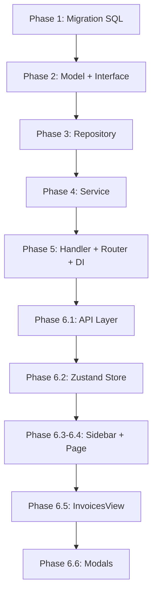

# Implementation Plan: Invoice (Hóa đơn) Feature

## Tổng quan

Phần Invoice cho phép Manager tạo hóa đơn hàng tháng cho từng phòng, xem danh sách hóa đơn với bộ lọc, xem chi tiết, và cập nhật trạng thái thanh toán. Plan này tuân thủ **100% cấu trúc hiện tại** của backend (Go) và frontend (React).

> [!IMPORTANT]
> **SECURITY & DATA ISOLATION (Bảo mật & Cô lập dữ liệu):**
> Để đảm bảo manager tuyệt đối không thể xem/sửa hóa đơn của người khác, plan này áp dụng cơ chế **Hard Filter tại Database Layer**:
> 1. Các truy vấn lấy danh sách (`ListInvoices`) và lấy chi tiết (`GetInvoiceByID`) **bắt buộc** phải truyền `manager_id`.
> 2. Câu SQL luôn `JOIN rooms JOIN houses` và thêm mệnh đề `WHERE h.manager_id = ?`.
> 3. Nếu manager gọi API với `invoice_id` hoặc `room_id` không thuộc quyền quản lý, Database sẽ tự động ẩn record và trả về `404 Not Found`. Lỗi lộ dữ liệu (Data Leakage) là 0%.

---

## Phase 1: Database Migration

### File: `migrations/000008_create_invoices_table.up.sql`

```sql
DO $$
BEGIN
    IF NOT EXISTS (SELECT 1 FROM pg_type WHERE typname = 'invoice_status') THEN
        CREATE TYPE invoice_status AS ENUM ('UNPAID', 'PARTIALLY_PAID', 'PAID');
    END IF;
END$$;

CREATE TABLE IF NOT EXISTS invoices (
    id                      UUID            PRIMARY KEY DEFAULT gen_random_uuid(),
    room_id                 UUID            NOT NULL REFERENCES rooms(id) ON DELETE CASCADE,
    period                  VARCHAR(7)      NOT NULL,  -- yyyy-mm format
    room_fee                DECIMAL(12,2)   NOT NULL DEFAULT 0,
    old_electricity_index   INT             NOT NULL DEFAULT 0,
    new_electricity_index   INT             NOT NULL DEFAULT 0,
    electricity_fee         DECIMAL(12,2)   NOT NULL DEFAULT 0,
    old_water_index         INT             NOT NULL DEFAULT 0,
    new_water_index         INT             NOT NULL DEFAULT 0,
    water_fee               DECIMAL(12,2)   NOT NULL DEFAULT 0,
    wifi_fee                DECIMAL(12,2)   NOT NULL DEFAULT 0,
    parking_fee             DECIMAL(12,2)   NOT NULL DEFAULT 0,
    service_fee             DECIMAL(12,2)   NOT NULL DEFAULT 0,
    other_fee               DECIMAL(12,2)   NOT NULL DEFAULT 0,
    discount                DECIMAL(12,2)   NOT NULL DEFAULT 0,
    total_amount            DECIMAL(12,2)   NOT NULL DEFAULT 0,
    status                  invoice_status  NOT NULL DEFAULT 'UNPAID',
    created_at              TIMESTAMPTZ     NOT NULL DEFAULT NOW(),

    CONSTRAINT uq_invoices_room_period UNIQUE (room_id, period)
);

CREATE INDEX IF NOT EXISTS idx_invoices_room_id ON invoices(room_id);
CREATE INDEX IF NOT EXISTS idx_invoices_period  ON invoices(room_id, period);
CREATE INDEX IF NOT EXISTS idx_invoices_status  ON invoices(status);
```

### File: `migrations/000008_create_invoices_table.down.sql`

```sql
DROP TABLE IF EXISTS invoices;
DROP TYPE IF EXISTS invoice_status;
```

> [!IMPORTANT]
> - `period` dùng `VARCHAR(7)` format `yyyy-mm` (VD: `2026-05`). Format này đảm bảo **lexicographic sort = chronological sort**, nên `ORDER BY period DESC` luôn đúng.
> - `UNIQUE (room_id, period)` phòng chống race condition tạo trùng hóa đơn ở DB level. Repository cần handle unique violation → trả `ErrDuplicateInvoice`.
> - `PARTIALLY_PAID` giữ trong ENUM để schema flexible cho tương lai, nhưng **v1 chỉ implement flow `UNPAID → PAID`**.

---

## Phase 2: Backend — Model

### File: `internal/model/invoice.go` (mới)

Theo pattern của [house.go](file:///media/minhchu1336/Data/quanly-phongtro/internal/model/house.go) và [tenant.go](file:///media/minhchu1336/Data/quanly-phongtro/internal/model/tenant.go):

**Struct types** (đặt trước functions):

| Struct | Mục đích |
|--------|----------|
| `Invoice` | Model chính, map 1:1 với bảng `invoices` |
| `InvoiceWithRoom` | Response struct cho List/Get — bổ sung `RoomName` từ JOIN |
| `InvoiceListFilter` | Chứa các filter param cho endpoint `GET /api/v1/invoice` |
| `InvoiceRepository` (interface) | Định nghĩa contract cho repository layer |

**Sentinel errors:**
- `ErrInvoiceNotFound`
- `ErrDuplicateInvoice` (trùng `room_id + period` — handle từ DB UNIQUE violation)
- `ErrInvalidElectricityIndex` (chỉ số điện mới < cũ)
- `ErrInvalidWaterIndex` (chỉ số nước mới < cũ)

**Invoice struct fields:**
```
ID, RoomID, Period, RoomFee,
OldElectricityIndex, NewElectricityIndex, ElectricityFee,
OldWaterIndex, NewWaterIndex, WaterFee,
WifiFee, ParkingFee, ServiceFee, OtherFee,
Discount, TotalAmount, Status, CreatedAt
```

**InvoiceWithRoom struct** (dùng cho response API, tránh leak raw model):
```go
type InvoiceWithRoom struct {
    Invoice
    RoomName string `json:"room_name"`
}
```

**InvoiceListFilter fields:**
```
HouseID, RoomID, Period, Status string
Page, Limit int
```

**InvoiceRepository interface methods:**

| Method | Chức năng |
|--------|-----------|
| `CreateInvoice(ctx, *Invoice) error` | Insert mới (handle unique violation → `ErrDuplicateInvoice`) |
| `GetInvoiceByID(ctx, managerID, id string) (*InvoiceWithRoom, error)` | Chi tiết + JOIN room name + **`manager_id` security filter** |
| `ListInvoices(ctx, managerID string, filter InvoiceListFilter) ([]InvoiceWithRoom, error)` | Danh sách có filter + JOIN + **`manager_id` security filter** |
| `UpdateInvoiceStatus(ctx, id, status string) (*Invoice, error)` | Đổi trạng thái thanh toán |
| `GetLatestInvoiceByRoomID(ctx, roomID string) (*Invoice, error)` | Lấy hóa đơn gần nhất (để lấy chỉ số cũ) |

### File: `internal/model/house.go` (sửa — thêm method vào RoomRepository interface)

> [!CAUTION]
> `RoomRepository.GetRoomByID()` hiện tại yêu cầu `houseID`. Invoice flow chỉ có `room_id`, không biết `house_id`. Cần thêm method mới:

```go
// Trong RoomRepository interface, thêm:
GetRoomByIDOnly(ctx context.Context, id string) (*Room, error)
```

Implement ở `room_repository.go`:
```go
func (r *RoomRepository) GetRoomByIDOnly(ctx context.Context, id string) (*model.Room, error) {
    var room model.Room
    err := r.db.NewSelect().Model(&room).Where("id = ?", id).Scan(ctx)
    // handle sql.ErrNoRows → model.ErrRoomNotFound
    return &room, nil
}
```

---

## Phase 3: Backend — Repository

### File: `internal/repository/invoice_repository.go` (mới)

Theo pattern của [room_repository.go](file:///media/minhchu1336/Data/quanly-phongtro/internal/repository/room_repository.go):

```
struct InvoiceRepository { db *bun.DB }
func NewInvoiceRepository(db *bun.DB) *InvoiceRepository
```

**Key implementation notes:**

1. **`CreateInvoice`**: Dùng `NewInsert().Model(invoice).Column(...)`.Returning("id, created_at")`. Handle **unique violation** (duplicate `room_id + period`) → return `model.ErrDuplicateInvoice`.
2. **`ListInvoices`** — **JOIN rooms + houses** để:
   - Lấy `room_name` cho response
   - **Filter `h.manager_id = ?`** (bắt buộc, tránh security hole)
   ```sql
   SELECT i.*, r.name AS room_name
   FROM invoices i
   JOIN rooms r ON i.room_id = r.id
   JOIN houses h ON r.house_id = h.id
   WHERE h.manager_id = ?
     AND (filter.RoomID = '' OR i.room_id = ?)
     AND (filter.HouseID = '' OR r.house_id = ?)
     AND (filter.Period = '' OR i.period = ?)
     AND (filter.Status = '' OR i.status = ?)
   ORDER BY i.created_at DESC
   LIMIT ? OFFSET ?
   ```
3. **`GetInvoiceByID`** — JOIN rooms + houses để trả `InvoiceWithRoom` VÀ **bảo mật dữ liệu**:
   ```sql
   SELECT i.*, r.name AS room_name
   FROM invoices i
   JOIN rooms r ON i.room_id = r.id
   JOIN houses h ON r.house_id = h.id
   WHERE i.id = ? AND h.manager_id = ?
   ```
   *(Nếu không tìm thấy do sai ID hoặc không phải chủ nhà → trả về ErrInvoiceNotFound)*
4. **`GetLatestInvoiceByRoomID`**: `WHERE room_id = ? ORDER BY period DESC LIMIT 1` (lexicographic sort = chronological sort vì format `yyyy-mm`).
5. **`UpdateInvoiceStatus`**: Giống `UpdateRoomStatus` — `.Set("status = ?").Where("id = ?").Returning(...)`.

> [!NOTE]
> Không cần `CheckDuplicateInvoice` method riêng nữa — DB UNIQUE constraint + error handling trong `CreateInvoice` đã đủ.

---

## Phase 4: Backend — Service

### File: `internal/service/invoice_service.go` (mới)

Theo pattern của [room_service.go](file:///media/minhchu1336/Data/quanly-phongtro/internal/service/room_service.go):

**Interface:**
```go
type InvoiceService interface {
    CreateInvoice(ctx, managerID string, input CreateInvoiceInput) (*model.InvoiceWithRoom, error)
    GetInvoice(ctx, managerID, invoiceID string) (*model.InvoiceWithRoom, error)
    ListInvoices(ctx, managerID string, filter model.InvoiceListFilter) ([]model.InvoiceWithRoom, error)
    PayInvoice(ctx, managerID, invoiceID string) (*model.Invoice, error)
}
```

**Struct:**
```go
type InvoiceServiceImpl struct {
    invoiceRepository model.InvoiceRepository
    roomRepository    model.RoomRepository
    houseRepository   model.HouseRepository
}
```

**Input DTO:**

| Field | Type | Ghi chú |
|-------|------|---------|
| `RoomID` | string | required |
| `Period` | string | required, format yyyy-mm |
| `NewElectricityIndex` | int | required |
| `NewWaterIndex` | int | required |
| `OtherFee` | float64 | optional |
| `Discount` | float64 | optional |

**Business logic cho `CreateInvoice` (quan trọng nhất):**

```
1. Validate input (roomID, period format yyyy-mm)
2. Lấy room info dùng GetRoomByIDOnly(roomID) → room_fee = room.Price, house_id = room.HouseID
3. checkOwnership: houseRepository.IsHouseOwnedBy(house_id, managerID)
4. Lấy house info → giá điện, nước, wifi, parking, service
5. Xác định chỉ số cũ:
   - Lấy từ GetLatestInvoiceByRoomID → NewElectricityIndex của invoice trước
   - Nếu chưa có invoice trước đó → old = 0
   - Tương tự cho OldWaterIndex
6. Validate chỉ số:
   - Nếu new_electricity_index < old_electricity_index → return ErrInvalidElectricityIndex
   - Nếu new_water_index < old_water_index → return ErrInvalidWaterIndex
7. Tính toán:
   - electricity_fee = (new - old) * house.DefaultElectricityPrice
   - water_fee = (new - old) * house.DefaultWaterPrice
   - wifi_fee = house.DefaultWifiPrice
   - parking_fee = house.DefaultParkingPrice
   - service_fee = house.DefaultServicePrice
   - total_amount = room_fee + electricity_fee + water_fee + wifi_fee + parking_fee + service_fee + other_fee - discount
8. Create invoice record (DB UNIQUE constraint sẽ reject nếu trùng room_id + period)
9. Lấy lại invoice với JOIN để trả InvoiceWithRoom (hoặc return và handler gọi GetInvoiceByID)
```

**`PayInvoice` logic:**
1. Lấy invoice bằng `GetInvoiceByID(ctx, managerID, invoiceID)` (Đã tự động verify ownership tại DB level)
2. Nếu lỗi `ErrInvoiceNotFound` → return
3. Check: nếu invoice.Status == `PAID` → return error (hoặc no-op)
4. Update status → `PAID`

> [!NOTE]
> `PARTIALLY_PAID` status được giữ trong schema nhưng **không implement ở v1**. Sẽ bổ sung khi có payment tracking chi tiết.

**`GetInvoice` logic:**
1. Trả về trực tiếp kết quả của `GetInvoiceByID(ctx, managerID, invoiceID)` (Đã tự động verify ownership + JOIN room name tại DB level)


---

## Phase 5: Backend — Handler & Router

### File: `internal/handler/invoice_handler.go` (mới)

Theo pattern của [room_handler.go](file:///media/minhchu1336/Data/quanly-phongtro/internal/handler/room_handler.go):

**Struct & constructor:**
```go
type InvoiceHandler struct {
    invoiceService service.InvoiceService
}
func NewInvoiceHandler(invoiceService service.InvoiceService) *InvoiceHandler
```

**Request DTOs:**
```go
type createInvoiceRequest struct {
    RoomID               string   `json:"room_id" validate:"required"`
    Period               string   `json:"period" validate:"required"`
    NewElectricityIndex  int      `json:"new_electricity_index" validate:"gte=0"`
    NewWaterIndex        int      `json:"new_water_index" validate:"gte=0"`
    OtherFee             float64  `json:"other_fee" validate:"gte=0"`
    Discount             float64  `json:"discount" validate:"gte=0"`
}
```

**`handleInvoiceError`** cần handle thêm:
- `ErrDuplicateInvoice` → HTTP 409 Conflict
- `ErrInvalidElectricityIndex` → HTTP 400 Bad Request
- `ErrInvalidWaterIndex` → HTTP 400 Bad Request

**Endpoints:**

| Handler Method | HTTP | Path | Mô tả |
|----------------|------|------|--------|
| `CreateInvoice` | POST | `/api/v1/invoice/` | Tạo hóa đơn, JSON body |
| `ListInvoices` | GET | `/api/v1/invoice/` | Danh sách, query params filter |
| `GetInvoice` | GET | `/api/v1/invoice/{id}` | Chi tiết hóa đơn |
| `PayInvoice` | PATCH | `/api/v1/invoice/{id}/pay` | Đánh dấu đã thanh toán |

**Error handler** — `handleInvoiceError(w, r, err)` theo pattern `handleRoomError`.

### File: `internal/router/router.go` (sửa)

Thêm route group mới và cập nhật `New()` signature:

```go
// Trong New(), thêm param: invoiceHandler *handler.InvoiceHandler
r.Route("/api/v1/invoice", func(r chi.Router) {
    r.Use(authMiddleware(tokenProvider))
    r.Use(requireRole("MANAGER"))
    r.Post("/", invoiceHandler.CreateInvoice)
    r.Get("/", invoiceHandler.ListInvoices)
    r.Get("/{id}", invoiceHandler.GetInvoice)
    r.Patch("/{id}/pay", invoiceHandler.PayInvoice)
})
```

### File: `cmd/api/main.go` (sửa)

Thêm DI wiring:
```go
invoiceRepo := repository.NewInvoiceRepository(sqlDB)
invoiceService := service.NewInvoiceService(invoiceRepo, roomRepo, houseRepo)
invoiceHandler := httpHandler.NewInvoiceHandler(invoiceService)

// Update router.New() call to include invoiceHandler
```

---

## Phase 6: Frontend

### 6.1 — API Layer

#### File: `frontend/src/api/invoice.tsx` (mới)

Theo pattern của [room.tsx](file:///media/minhchu1336/Data/quanly-phongtro/frontend/src/api/room.tsx):

```typescript
export interface Invoice {
  id: string
  room_id: string
  room_name: string    // from JOIN
  period: string
  room_fee: number
  old_electricity_index: number
  new_electricity_index: number
  electricity_fee: number
  old_water_index: number
  new_water_index: number
  water_fee: number
  wifi_fee: number
  parking_fee: number
  service_fee: number
  other_fee: number
  discount: number
  total_amount: number
  status: string
  created_at: string
}

export interface CreateInvoicePayload {
  room_id: string
  period: string
  new_electricity_index: number
  new_water_index: number
  other_fee?: number
  discount?: number
}

export interface InvoiceFilter {
  house_id?: string
  room_id?: string
  period?: string
  status?: string
  page?: number
  limit?: number
}
```

**Exported functions:**

| Function | Method | Endpoint |
|----------|--------|----------|
| `getInvoices(filter)` | GET | `/invoice?...queryParams` |
| `getInvoiceById(id)` | GET | `/invoice/${id}` |
| `createInvoice(payload)` | POST | `/invoice/` |
| `payInvoice(id)` | PATCH | `/invoice/${id}/pay` |

### 6.2 — Zustand Store

#### File: `frontend/src/data/invoiceData.tsx` (mới)

Theo pattern của [roomData.tsx](file:///media/minhchu1336/Data/quanly-phongtro/frontend/src/data/roomData.tsx):

**State interface:**
```typescript
interface InvoiceDataState {
  invoices: Invoice[]
  invoiceFilter: InvoiceFilter
  setInvoiceFilter: (filter: Partial<InvoiceFilter>) => void
  fetchInvoices: (filter: InvoiceFilter) => Promise<void>
  createInvoice: (payload: CreateInvoicePayload) => Promise<boolean>
  payInvoice: (invoiceId: string) => Promise<boolean>
}
```

**Key behaviors:**
- `fetchInvoices`: Call API → set `invoices`
- `createInvoice`: **Không dùng optimistic update** (backend tính toán phần lớn data). Flow: call API → on success → `fetchInvoices()` để refresh list → return true/false
- `payInvoice`: **Dùng optimistic update** (chỉ đổi status field): set `status: 'PAID'` local → call API → rollback on error

### 6.3 — Sidebar Update

#### File: `frontend/src/data/selectedData.tsx` (sửa)

Thêm `'invoices'` vào `TabType`:
```typescript
type TabType = 'dashboard' | 'house_rooms' | 'tenants' | 'invoices'
```

#### File: `frontend/src/components/home/sidebar/Sidebar.tsx` (sửa)

Thêm SidebarItem cho "Hóa đơn" (dùng icon `Receipt` từ lucide-react):
```tsx
<SidebarItem
  icon={<Receipt />}
  label="Hóa đơn"
  active={activeTab === 'invoices'}
  onClick={() => handleTabClick('invoices')}
  collapsed={isSidebarCollapsed}
/>
```

### 6.4 — Page Update

#### File: `frontend/src/pages/Home.tsx` (sửa)

Thêm tab render:
```tsx
{activeTab === 'invoices' && (
  <InvoicesView />
)}
```

### 6.5 — View Component

#### File: `frontend/src/components/home/InvoicesView.tsx` (mới)

Theo pattern của [HouseRoomsView.tsx](file:///media/minhchu1336/Data/quanly-phongtro/frontend/src/components/home/HouseRoomsView.tsx):

**Layout structure:**
```
┌──────────────────────────────────────────────────┐
│  Header: "Hóa đơn"  +  [Tạo hóa đơn] button    │
├──────────────────────────────────────────────────┤
│  Filter bar: [Nhà trọ ▼] [Phòng ▼] [Kỳ] [TT ▼] │
├──────────────────────────────────────────────────┤
│  Invoice Table/Cards (responsive)                │
│  ┌─────┬──────┬─────┬──────────┬────────┬──────┐ │
│  │ Kỳ  │Phòng │Tổng │Trạng thái│Ngày tạo│ ...  │ │
│  └─────┴──────┴─────┴──────────┴────────┴──────┘ │
├──────────────────────────────────────────────────┤
│  Pagination                                      │
└──────────────────────────────────────────────────┘
```

**Features:**
- Filter theo `house_id` (dropdown chọn nhà), `room_id` (dropdown chọn phòng, load từ `useRoomStore`), `period`, `status`
- Click row → mở `InvoiceDetailModal`
- Status badges: `UNPAID` (đỏ), `PARTIALLY_PAID` (vàng), `PAID` (xanh)
- Nút "Đánh dấu đã thanh toán" inline hoặc trong detail modal

**Stores used:**
- `useInvoiceStore` — data + actions
- `useHouseStore` — danh sách nhà cho filter dropdown
- `useRoomStore.getRoomsByHouse()` — danh sách phòng cho filter dropdown
- `useSelectedStore` — active house context

### 6.6 — Modal Components

#### File: `frontend/src/components/home/modals/CreateInvoiceModal.tsx` (mới)

Theo pattern của [CreateRoomModal.tsx](file:///media/minhchu1336/Data/quanly-phongtro/frontend/src/components/home/modals/CreateRoomModal.tsx) — dùng **React Hook Form + Zod**:

**Form fields:**

| Field | Type | Validation |
|-------|------|------------|
| Chọn nhà trọ | Select dropdown | required |
| Chọn phòng | Select dropdown (load theo nhà) | required |
| Kỳ hóa đơn (period) | month-year picker | required, format yyyy-mm |
| Chỉ số điện mới | number input | required, >= 0 |
| Chỉ số nước mới | number input | required, >= 0 |
| Phí khác | number input | optional, >= 0 |
| Giảm giá | number input | optional, >= 0 |

**Props:** `onClose: () => void`

**Behavior:**
- Modal closes on Escape + backdrop click
- Submit → `useInvoiceStore.createInvoice()`
- Loading state on submit button
- On success → close modal

#### File: `frontend/src/components/home/modals/InvoiceDetailModal.tsx` (mới)

**Props:** `invoice: Invoice, onClose: () => void`

**Layout:**
```
┌──────────────────────────────────────┐
│  Phòng 101 — Kỳ 05/2026             │
├──────────────────────────────────────┤
│  Tiền phòng:          1,500,000đ     │
│  ─────────────────────────────       │
│  Điện cũ: 100 → Mới: 150            │
│  Tiền điện:             150,000đ     │
│  ─────────────────────────────       │
│  Nước cũ: 10 → Mới: 15              │
│  Tiền nước:              75,000đ     │
│  ─────────────────────────────       │
│  WiFi:                   50,000đ     │
│  Gửi xe:                 50,000đ     │
│  Dịch vụ:                30,000đ     │
│  Phí khác:                    0đ     │
│  Giảm giá:                    0đ     │
│  ═══════════════════════════════     │
│  TỔNG CỘNG:          1,855,000đ     │
├──────────────────────────────────────┤
│  Trạng thái: [UNPAID badge]         │
│  [Đánh dấu đã thanh toán] button    │
└──────────────────────────────────────┘
```

**Behavior:**
- Nút "Đánh dấu đã thanh toán" → `useInvoiceStore.payInvoice(id)` → loading → optimistic update
- Không hiện nút nếu đã `PAID`

---

## Tóm tắt file changes

### Backend — Files mới (5):
| File | Layer |
|------|-------|
| `migrations/000008_create_invoices_table.up.sql` | Database |
| `migrations/000008_create_invoices_table.down.sql` | Database |
| `internal/model/invoice.go` | Model + Interface |
| `internal/repository/invoice_repository.go` | Repository |
| `internal/service/invoice_service.go` | Service |
| `internal/handler/invoice_handler.go` | Handler |

### Backend — Files sửa (4):
| File | Thay đổi |
|------|----------|
| `internal/model/house.go` | **Thêm `GetRoomByIDOnly` vào `RoomRepository` interface** |
| `internal/repository/room_repository.go` | **Thêm `GetRoomByIDOnly` implementation** |
| `internal/router/router.go` | Thêm `/api/v1/invoice` route group + param `invoiceHandler` |
| `cmd/api/main.go` | Thêm DI wiring cho invoice repo/service/handler |

### Frontend — Files mới (5):
| File | Layer |
|------|-------|
| `frontend/src/api/invoice.tsx` | API |
| `frontend/src/data/invoiceData.tsx` | Store (Zustand) |
| `frontend/src/components/home/InvoicesView.tsx` | View |
| `frontend/src/components/home/modals/CreateInvoiceModal.tsx` | Modal |
| `frontend/src/components/home/modals/InvoiceDetailModal.tsx` | Modal |

### Frontend — Files sửa (3):
| File | Thay đổi |
|------|----------|
| `frontend/src/data/selectedData.tsx` | Thêm `'invoices'` vào `TabType` |
| `frontend/src/components/home/sidebar/Sidebar.tsx` | Thêm sidebar item "Hóa đơn" |
| `frontend/src/pages/Home.tsx` | Thêm tab render cho `InvoicesView` |

---

## Verification Plan

### Backend (cURL/Postman — sau Phase 5)

| # | Test case | Expected |
|---|-----------|----------|
| 1 | `POST /invoice/` — tạo hóa đơn hợp lệ | 201, tính toán đúng total_amount, room_name có trong response |
| 2 | `POST /invoice/` — trùng `room_id + period` | 409 Conflict + `ErrDuplicateInvoice` |
| 3 | `POST /invoice/` — `new_electricity_index < old` | 400 + `ErrInvalidElectricityIndex` |
| 4 | `GET /invoice/` — filter theo house_id, room_id, status | Data đúng, chỉ thấy invoice của mình |
| 5 | `GET /invoice/` — dùng token manager khác | Không thấy invoice của người khác (security) |
| 6 | `GET /invoice/:id` — invoice của manager khác | 404 Not Found |
| 7 | `PATCH /invoice/:id/pay` — UNPAID → PAID | 200, status = PAID |
| 8 | `PATCH /invoice/:id/pay` — đã PAID rồi | Error hoặc idempotent 200 |

### Frontend (sau Phase 6)

| # | Test case | Expected |
|---|-----------|----------|
| 1 | Sidebar → click "Hóa đơn" | `InvoicesView` hiện đúng |
| 2 | Tạo hóa đơn — form validation | Required fields báo lỗi, chỉ số >= 0 |
| 3 | Tạo hóa đơn — submit thành công | Modal đóng, list refresh, invoice mới xuất hiện |
| 4 | Filter thay đổi nhà/phòng/trạng thái | List update tương ứng |
| 5 | Click invoice row | `InvoiceDetailModal` hiện đúng với room_name |
| 6 | Đánh dấu thanh toán | Status badge đổi màu UNPAID(đỏ) → PAID(xanh) |
| 7 | Escape + backdrop click | Modal đóng |


---

## Thứ tự thực hiện đề xuất



> [!TIP]
> Nên test backend trước bằng cURL/Postman sau Phase 5, rồi mới chuyển sang frontend.
