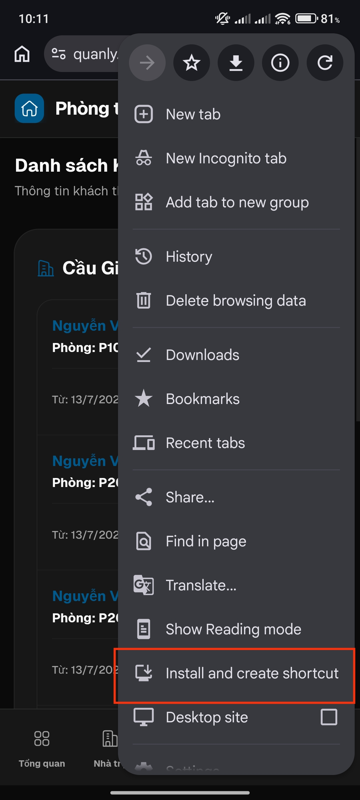
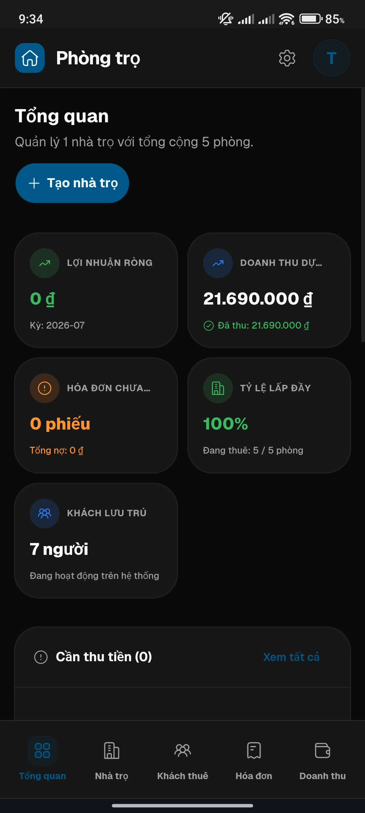
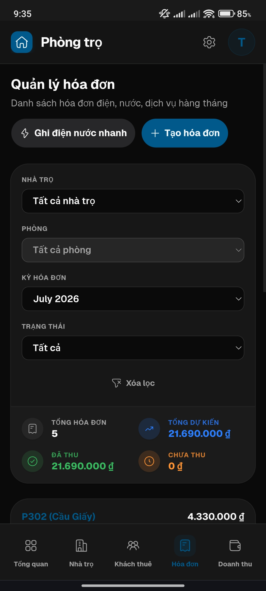
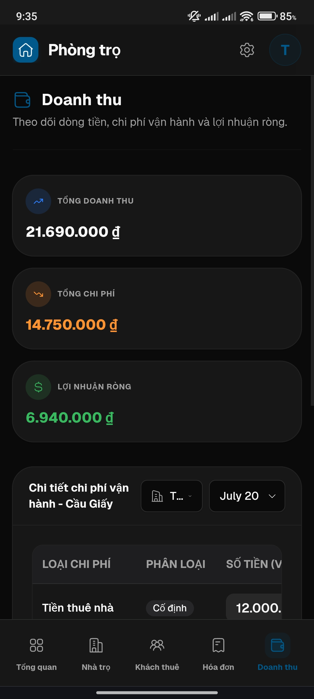
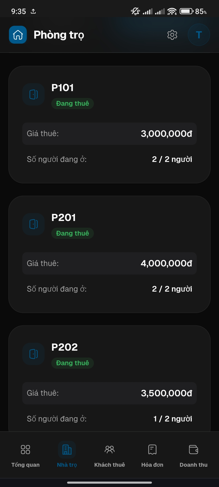
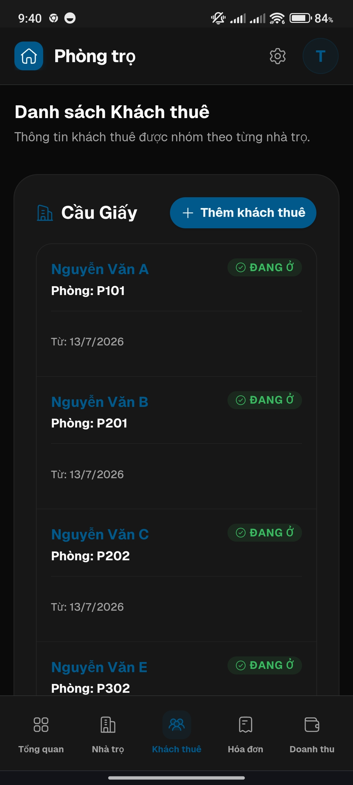

# quanly-phongtro

[English 🇺🇸](Documents/README_EN.md)

## Demo
- **URL:** https://quanly.ptro.site
- **Email:** `user@test.com`
- **Pass:** `test01234`

### Mobile

<p align="center">
  &nbsp;&nbsp;&nbsp;&nbsp;&nbsp;
  &nbsp;&nbsp;&nbsp;&nbsp;&nbsp;
  
  <br /><br />
  &nbsp;&nbsp;&nbsp;&nbsp;&nbsp;
  &nbsp;&nbsp;&nbsp;&nbsp;&nbsp;
  
</p>

Ứng dụng quản lý nhà trọ/phòng trọ full-stack với backend viết bằng Go và frontend bằng React.

Trong môi trường production, frontend React được build và **nhúng trực tiếp vào file thực thi Go**, toàn bộ ứng dụng được đóng gói và chạy dưới dạng **một file thực thi duy nhất**. Trong quá trình phát triển (development), frontend và backend vẫn chạy như hai dev server riêng biệt.

## Các tính năng chính

- **Xác thực & Bảo mật:** Đăng ký/đăng nhập, refresh token, xác minh email, phân quyền RBAC (quản lý/người thuê). Bảo mật bằng JWT + DPoP. Xem [security_dpop](Documents/feature/security_dpop.md).
- **Quản lý nhà & phòng:** CRUD nhà và phòng, cấu hình linh hoạt giá thuê, điện, nước, Wi-Fi, chỗ để xe và dịch vụ/phụ phí tùy chỉnh ở cả cấp nhà lẫn phòng.
- **Quản lý người thuê:** Đăng ký người thuê theo phòng, cập nhật hồ sơ, lưu CCCD/hợp đồng và tìm kiếm theo phòng hoặc nhà.
- **Hóa đơn & Thanh toán:** Tự động tạo hóa đơn hàng tháng (tiện ích, dịch vụ, phụ phí, giảm giá), theo dõi trạng thái thanh toán, lưu ảnh giao dịch và render ảnh hóa đơn.
- **Doanh thu & Chi phí:** Ghi nhận chi phí định kỳ, tổng hợp doanh thu/chi phí/lợi nhuận theo từng nhà qua background worker hướng sự kiện (`EventBus` + `RevenueWorker`).
- **Tích hợp Zalo & PayOS:** Tạo QR/liên kết thanh toán PayOS, cập nhật trạng thái qua webhook; bot Zalo gửi hóa đơn, tạo/cập nhật hóa đơn qua chat và cron kiểm tra token. Xem [zalo_bot_feature](Documents/feature/zalo_bot_feature.md), [zalo_automation](Documents/feature/zalo_automation_mark_paid_invoice.md).
- **Tích hợp SePay:** QR động cho hóa đơn, tự động đánh dấu `PAID` qua webhook hoặc đối soát thủ công qua SePay API v2, ghi mọi giao dịch vào `payment_events`. Xem [sepay_integration](Documents/feature/sepay_integration.md).

## Cấu trúc dự án

Đây là một monorepo chứa cả backend và frontend:

```text
├── cmd/
│   ├── api/main.go               # Điểm vào (entrypoint) của Backend Go
│   └── seed/main.go              # Database seeder (tạo dữ liệu mẫu)
├── internal/                     # Backend Go (Kiến trúc Clean Architecture)
│   ├── model/                    # Entities và Interfaces
│   ├── handler/                  # HTTP Handlers (chi router)
│   ├── service/                  # Business Logic & Rules
│   ├── repository/               # Data Access (Bun ORM)
│   ├── db/                       # Thiết lập kết nối cơ sở dữ liệu
│   ├── router/                   # Cấu hình API Routes + SPA fallback
│   ├── security/                 # JWT, bcrypt, mã hóa
│   ├── assets/                   # Các tài sản được nhúng (fonts, DB GeoIP)
│   ├── web/                      # Bản build frontend được nhúng (dist) phục vụ bởi API
│   └── mock/                     # Mocks cho unit testing
├── migrations/                   # SQL Schema migrations (golang-migrate)
└── frontend/                     # Frontend React
    ├── src/components/           # Các UI component có thể tái sử dụng (shadcn)
    ├── src/pages/                # Các trang (views) của ứng dụng
    ├── src/router/               # Cấu hình React Router
    └── src/data/                 # Tích hợp API và Quản lý trạng thái (Zustand)
```

## Công nghệ sử dụng

### Backend
- **Ngôn ngữ:** Go 1.26
- **Framework:** chi/v5 (Router)
- **Cơ sở dữ liệu:** PostgreSQL với Bun ORM
- **Migrations:** golang-migrate
- **Validation:** go-playground/validator
- **Bảo mật:** bcrypt + JWT

### Frontend
- **Framework:** React 19 + Vite
- **Styling:** Tailwind CSS v4 + Base UI
- **Quản lý trạng thái:** Zustand
- **Forms:** React Hook Form + Zod
- **Routing:** React Router DOM v7

## Thiết lập môi trường

Sử dụng file `.env.example` làm tài liệu tham khảo để tạo file `.env` của bạn ở thư mục gốc:
```bash
cp .env.example .env
```

## Chạy ứng dụng

### 1. Database Migrations (Chạy kịch bản cơ sở dữ liệu)

Dự án sử dụng `golang-migrate` để quản lý schema cơ sở dữ liệu PostgreSQL.

Áp dụng tất cả các migration đang chờ xử lý:
```bash
# Tải các biến môi trường từ .env
set -a && source .env && set +a

# Chạy up migrations
migrate -path migrations -database "$POSTGRES_DSN" up
```

*(Tùy chọn)* Tạo dữ liệu mẫu (Seed):
```bash
go run ./cmd/seed
```

### 2. Môi trường Phát triển (backend + frontend chạy riêng biệt)

Khởi động backend:
```bash
go run ./cmd/api
```
API server sẽ khởi động trên cổng `8080` (hoặc bất kỳ cổng nào được đặt trong biến `APP_PORT`).

Mở một terminal mới và khởi động Vite dev server (nó sẽ tự động proxy các request `/api` sang backend):
```bash
cd frontend
pnpm install
pnpm dev
```
Frontend sẽ được phục vụ tại `http://localhost:5173`.

> Trong chế độ dev, API **chỉ** phục vụ API — frontend được nhúng (`internal/web/dist`) chỉ là một placeholder (giữ chỗ). Giao diện người dùng sẽ được lấy từ Vite dev server.

### 3. Môi trường Thực tế (Production - file thực thi duy nhất)

Build frontend, nhúng nó vào backend và tạo ra một file thực thi duy nhất:
```bash
make build
```
Lệnh này sẽ chạy `pnpm build`, copy thư mục `frontend/dist` vào `internal/web/dist`, sau đó chạy `go build`. File binary `quanly-phongtro-api` thu được sẽ nhúng cả ứng dụng React **và** database GeoIP, và phục vụ cả UI cùng với API trên cổng `APP_PORT`:
```bash
./quanly-phongtro-api
```
Mở `http://localhost:8080` — UI React được phục vụ trực tiếp; `/api/v1/*` là các API trên cùng một origin.

> File thực thi tự bao gồm code, frontend và GeoIP. Tại thời điểm chạy (runtime), nó vẫn cần: một kết nối đến **PostgreSQL**, file cấu hình **`.env`** nằm cạnh nó và một thư mục **`uploads/`** để lưu trữ các file tải lên.

## Tổng quan API

Backend cung cấp một RESTful API dưới tiền tố `/api/v1/`. Các namespace chính bao gồm:

- **`Auth`** (`/api/v1/auth/*`): Đăng ký, đăng nhập, refresh token, và xác minh email.
- **`House`** (`/api/v1/house/*`): Các thao tác CRUD cho các khu nhà/phòng trọ (Chỉ dành cho Quản lý).
- **`Room`** (`/api/v1/room/*`): Các thao tác CRUD cho từng phòng trong một nhà, bao gồm định giá tùy chỉnh và phụ phí.
- **`Tenant`** (`/api/v1/tenant/*`): Đăng ký và quản lý người thuê theo phòng/nhà.
- **`Invoice`** (`/api/v1/invoice/*`): Tạo, theo dõi, tạo hình ảnh và trạng thái thanh toán của các hóa đơn tiện ích/tiền thuê phòng hàng tháng.
- **`Zalo`** (`/api/v1/zalo/*`): Tích hợp với Zalo mini-app, bot, và xử lý webhook cho các thông báo.
- **`Payments`** (`/api/v1/payments/*`): Cấu hình provider SePay, tạo QR/liên kết thanh toán, xử lý webhook chuyển khoản và đối soát giao dịch qua SePay API v2.
- **`Health`** (`/health`): Endpoint kiểm tra tình trạng (health-check) công khai.

