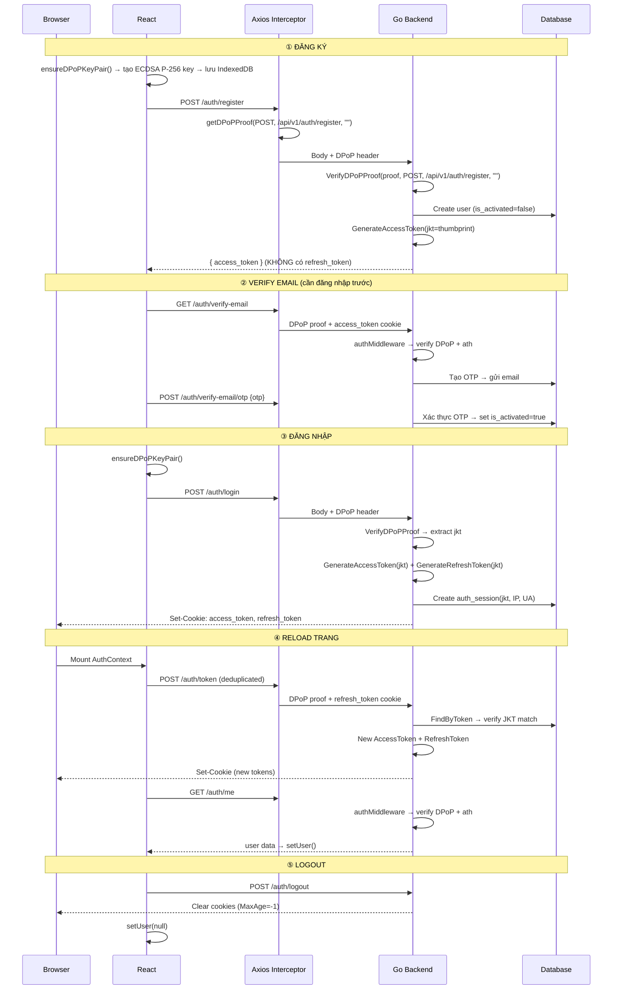

# Báo cáo Review luồng DPoP Authentication

## Tổng quan

Review toàn bộ luồng bảo mật DPoP từ **Đăng ký → Verify Email → Đăng nhập → Reload → Logout**, bao gồm cả Backend (Go) và Frontend (React).

---

## 1. Kiến trúc tổng thể



---

## 2. Kết quả tracing từng luồng

### ① Đăng ký (`POST /auth/register`)

| Bước | File | Trạng thái |
|------|------|:----------:|
| Frontend gọi `ensureDPoPKeyPair()` trước request | [auth.tsx:11](file:///media/minhchu1336/Data/quanly-phongtro/frontend/src/api/auth.tsx#L11) | ✅ |
| Axios interceptor sinh DPoP proof (không có `ath` vì chưa có token) | [client.tsx:26](file:///media/minhchu1336/Data/quanly-phongtro/frontend/src/api/client.tsx#L26) | ✅ |
| Backend verify DPoP proof đầy đủ (signature, htm, htu, iat, jti) | [auth_handler.go:68](file:///media/minhchu1336/Data/quanly-phongtro/internal/handler/auth_handler.go#L68) | ✅ |
| Access token chứa `cnf.jkt` | [jwt.go:40-42](file:///media/minhchu1336/Data/quanly-phongtro/internal/security/jwt.go#L40-L42) | ✅ |
| Response trả `access_token` nhưng **KHÔNG set cookies** | [auth_handler.go:100](file:///media/minhchu1336/Data/quanly-phongtro/internal/handler/auth_handler.go#L100) | ⚠️ |

> [!WARNING]
> **Phát hiện #1: Register không tạo session & không set cookie**
>
> Hàm `Register` trong [auth_service.go:111-163](file:///media/minhchu1336/Data/quanly-phongtro/internal/service/auth_service.go#L111-L163) chỉ sinh `access_token` (không sinh `refresh_token`), và handler ở [auth_handler.go:100](file:///media/minhchu1336/Data/quanly-phongtro/internal/handler/auth_handler.go#L100) chỉ gọi `writeJSON` — **không gọi `setTokenCookies`**.
>
> Hậu quả: Sau đăng ký, Frontend nhận `access_token` qua JSON body và lưu vào `currentAccessToken` memory. Nhưng browser **không có cookie `access_token`** → nếu user refresh trang ngay sau đăng ký, `authMiddleware` sẽ không tìm thấy token trong cookie → bị mất phiên.
>
> Tuy nhiên, luồng hiện tại của Frontend ([Register.tsx:68](file:///media/minhchu1336/Data/quanly-phongtro/frontend/src/pages/Register.tsx#L68)) gọi `login(user)` để set user vào context, rồi navigate về `/`. Vì user mới đăng ký chưa activated, nên hành vi này **vẫn chấp nhận được** — user sẽ cần verify email rồi login lại. Đây là thiết kế có chủ đích (chứ không phải bug).

---

### ② Verify Email (`GET /auth/verify-email` + `POST /auth/verify-email/otp`)

| Bước | File | Trạng thái |
|------|------|:----------:|
| Route nằm trong `authMiddleware` group | [router.go:32-36](file:///media/minhchu1336/Data/quanly-phongtro/internal/router/router.go#L32-L36) | ✅ |
| Middleware verify DPoP proof nếu token có `cnf.jkt` | [auth_middleware.go:47-63](file:///media/minhchu1336/Data/quanly-phongtro/internal/router/auth_middleware.go#L47-L63) | ✅ |
| CreateOTP kiểm tra `claims.IsActivated` để chặn spam | [auth_handler.go:280-284](file:///media/minhchu1336/Data/quanly-phongtro/internal/handler/auth_handler.go#L280-L284) | ✅ |
| VerifyEmail kiểm tra OTP + rate limit | [auth_handler.go:295-349](file:///media/minhchu1336/Data/quanly-phongtro/internal/handler/auth_handler.go#L295-L349) | ✅ |

> [!NOTE]
> **Nhận xét:** Luồng verify email tương thích hoàn toàn với DPoP. Tuy nhiên, hiện tại Frontend **chưa có trang Verify Email** (không tìm thấy component nào gọi `/auth/verify-email` hoặc `/auth/verify-email/otp`). Backend đã sẵn sàng, nhưng UI chưa được triển khai.

---

### ③ Đăng nhập (`POST /auth/login`)

| Bước | File | Trạng thái |
|------|------|:----------:|
| Frontend gọi `ensureDPoPKeyPair()` trước request | [auth.tsx:21](file:///media/minhchu1336/Data/quanly-phongtro/frontend/src/api/auth.tsx#L21) | ✅ |
| Backend verify DPoP proof | [auth_handler.go:122-130](file:///media/minhchu1336/Data/quanly-phongtro/internal/handler/auth_handler.go#L122-L130) | ✅ |
| AccessToken sinh với `cnf.jkt` | [auth_service.go:186](file:///media/minhchu1336/Data/quanly-phongtro/internal/service/auth_service.go#L186) | ✅ |
| RefreshToken sinh với `jkt` + `jti` unique | [jwt.go:61-97](file:///media/minhchu1336/Data/quanly-phongtro/internal/security/jwt.go#L61-L97) | ✅ |
| Session lưu vào DB (jkt, IP, UserAgent, Location) | [jwt.go:83-94](file:///media/minhchu1336/Data/quanly-phongtro/internal/security/jwt.go#L83-L94) | ✅ |
| Cookies được set đúng (HttpOnly, SameSite=Lax) | [auth_handler.go:250-270](file:///media/minhchu1336/Data/quanly-phongtro/internal/handler/auth_handler.go#L250-L270) | ✅ |
| Frontend gọi `setAccessToken()` để sync memory | [auth.tsx:23](file:///media/minhchu1336/Data/quanly-phongtro/frontend/src/api/auth.tsx#L23) | ✅ |
| Frontend gọi `getMe()` để lấy user data | [Login.tsx:61](file:///media/minhchu1336/Data/quanly-phongtro/frontend/src/pages/Login.tsx#L61) | ✅ |

> [!TIP]
> Luồng đăng nhập hoạt động hoàn chỉnh. Test E2E xác nhận: login → 200 OK, me → 200 OK.

---

### ④ Reload trang (Session persistence)

| Bước | File | Trạng thái |
|------|------|:----------:|
| `AuthContext` mount → gọi `refreshToken()` | [AuthContext.tsx:21](file:///media/minhchu1336/Data/quanly-phongtro/frontend/src/contexts/AuthContext.tsx#L21) | ✅ |
| Promise deduplication ngăn race condition | [auth.tsx:30-49](file:///media/minhchu1336/Data/quanly-phongtro/frontend/src/api/auth.tsx#L30-L49) | ✅ |
| Backend xác thực refresh_token + verify JKT match | [auth_service.go:247-253](file:///media/minhchu1336/Data/quanly-phongtro/internal/service/auth_service.go#L247-L253) | ✅ |
| Sinh token mới + set cookies mới | [auth_handler.go:198](file:///media/minhchu1336/Data/quanly-phongtro/internal/handler/auth_handler.go#L198) | ✅ |
| `setAccessToken()` sync memory → DPoP proof đúng | [auth.tsx:39](file:///media/minhchu1336/Data/quanly-phongtro/frontend/src/api/auth.tsx#L39) | ✅ |
| `getMe()` gọi với DPoP proof chứa `ath` đúng | [AuthContext.tsx:22](file:///media/minhchu1336/Data/quanly-phongtro/frontend/src/contexts/AuthContext.tsx#L22) | ✅ |
| `ensureDPoPKeyPair` có Promise dedup, không tạo 2 key | [dpop.tsx:18-51](file:///media/minhchu1336/Data/quanly-phongtro/frontend/src/utils/dpop.tsx#L18-L51) | ✅ |

> [!TIP]
> Test E2E xác nhận: reload → `/auth/token` 200 → `/auth/me` 200 → user vẫn ở trang chủ (không bị redirect về /login).

---

### ⑤ Logout (`POST /auth/logout`)

| Bước | File | Trạng thái |
|------|------|:----------:|
| Frontend gọi `logoutApi()` | [AuthContext.tsx:36](file:///media/minhchu1336/Data/quanly-phongtro/frontend/src/contexts/AuthContext.tsx#L36) | ✅ |
| Backend xoá cookies (MaxAge=-1) | [auth_handler.go:228-248](file:///media/minhchu1336/Data/quanly-phongtro/internal/handler/auth_handler.go#L228-L248) | ✅ |
| Frontend `setUser(null)` | [AuthContext.tsx:40](file:///media/minhchu1336/Data/quanly-phongtro/frontend/src/contexts/AuthContext.tsx#L40) | ✅ |
| Route **không** nằm trong `authMiddleware` | [router.go:38](file:///media/minhchu1336/Data/quanly-phongtro/internal/router/router.go#L38) | ✅ |

> [!WARNING]
> **Phát hiện #2: Logout không revoke session trong database**
>
> Hiện tại [auth_handler.go:223-226](file:///media/minhchu1336/Data/quanly-phongtro/internal/handler/auth_handler.go#L223-L226) chỉ xoá cookie nhưng **không gọi `RevokeRefreshToken()`** để đánh dấu session `revoked=true` trong database.
>
> Hậu quả: Nếu kẻ tấn công đã đánh cắp được refresh_token cookie trước khi user logout, kẻ tấn công vẫn có thể dùng token đó để lấy access_token mới (dù user đã logout). Token chỉ bị vô hiệu khi hết hạn tự nhiên (7 ngày).
>
> Tuy nhiên, nhờ có DPoP, kẻ tấn công cũng cần có Private Key trong IndexedDB của victim để sinh DPoP proof. Điều này giảm đáng kể mức độ nguy hiểm, nhưng vẫn nên revoke session cho đúng chuẩn.

---

## 3. Kết quả kiểm tra DPoP chi tiết

### Backend Security ([dpop.go](file:///media/minhchu1336/Data/quanly-phongtro/internal/security/dpop.go))

| Kiểm tra | Trạng thái |
|----------|:----------:|
| Verify chữ ký ES256 | ✅ |
| Kiểm tra `typ: dpop+jwt` | ✅ |
| Kiểm tra `htm` (HTTP method) | ✅ |
| Kiểm tra `htu` (URL path) | ✅ |
| Kiểm tra `iat` (time window ±5 phút) | ✅ |
| Nil check cho `iat` (ngăn panic) | ✅ |
| Kiểm tra `jti` replay (ReplayCache) | ✅ |
| Kiểm tra `ath` (access token hash) | ✅ |
| Tính JWK Thumbprint theo RFC 7638 | ✅ |
| ReplayCache tự cleanup mỗi phút | ✅ |

### Auth Middleware ([auth_middleware.go](file:///media/minhchu1336/Data/quanly-phongtro/internal/router/auth_middleware.go))

| Kiểm tra | Trạng thái |
|----------|:----------:|
| Skip DPoP nếu token không có `cnf.jkt` (backward compatible) | ✅ |
| Bắt buộc DPoP proof nếu token có `cnf.jkt` | ✅ |
| Verify DPoP (signature + htm + htu + ath) trên mỗi request | ✅ |
| So sánh `derivedJkt != jkt` (binding check) | ✅ |

### Auth Handler ([auth_handler.go](file:///media/minhchu1336/Data/quanly-phongtro/internal/handler/auth_handler.go))

| Endpoint | DPoP Verify | Trạng thái |
|----------|:-----------:|:----------:|
| `POST /auth/register` | `VerifyDPoPProof()` | ✅ |
| `POST /auth/login` | `VerifyDPoPProof()` | ✅ |
| `POST /auth/token` (refresh) | `VerifyDPoPProof()` | ✅ |
| `GET /auth/me` | Via `authMiddleware` | ✅ |
| `GET /auth/verify-email` | Via `authMiddleware` | ✅ |
| `POST /auth/verify-email/otp` | Via `authMiddleware` | ✅ |
| `POST /auth/logout` | Không cần (public route) | ✅ |

### Frontend ([dpop.tsx](file:///media/minhchu1336/Data/quanly-phongtro/frontend/src/utils/dpop.tsx), [client.tsx](file:///media/minhchu1336/Data/quanly-phongtro/frontend/src/api/client.tsx))

| Kiểm tra | Trạng thái |
|----------|:----------:|
| Key pair lưu IndexedDB (persist across reload) | ✅ |
| Private key `extractable: false` (không thể export) | ✅ |
| `ensureDPoPKeyPair()` có Promise dedup (ngăn race condition) | ✅ |
| `refreshToken()` có Promise dedup (ngăn double request) | ✅ |
| DPoP proof sinh `jti` random (crypto.randomUUID) | ✅ |
| DPoP proof sinh `ath` hash (SHA-256, base64url) | ✅ |
| Interceptor tự động gắn DPoP header cho mọi request | ✅ |

---

## 4. Kết quả Test

### Unit Tests
```
✅ internal/handler     — PASS (0.554s)
✅ internal/repository  — PASS (cached)
✅ internal/router      — PASS (0.007s)
✅ internal/security    — PASS (0.004s)
✅ internal/service     — PASS (0.114s)
✅ internal/service/email — PASS (cached)
```

### E2E Browser Test (Puppeteer)
```
✅ Login → 200 OK (access_token chứa cnf.jkt)
✅ GetMe → 200 OK (DPoP proof + ath verified)
✅ Reload → RefreshToken 200 → GetMe 200 → URL = / (không bị logout)
```

---

## 5. Tóm tắt các phát hiện

| # | Mức độ | Mô tả | Ảnh hưởng |
|---|--------|-------|-----------|
| 1 | ⚠️ Thấp | Register không set cookie → refresh trang mất phiên | Thiết kế có chủ đích (user cần verify email trước) |
| 2 | ⚠️ Trung bình | Logout không revoke session trong DB | Refresh token đánh cắp vẫn dùng được (giảm nhẹ nhờ DPoP binding) |
| 3 | 📝 Ghi nhận | Chưa có Frontend UI cho Verify Email | Backend sẵn sàng, cần thêm trang verify |

> [!IMPORTANT]
> **Kết luận: Luồng DPoP đã tương thích và hoạt động ổn định trên toàn bộ luồng đăng ký, đăng nhập, reload, và logout.** Không có lỗi crash hay mất bảo mật nghiêm trọng. Hai điểm cải thiện (revoke session khi logout, và UI verify email) là nâng cao chất lượng, không phải blocker.
