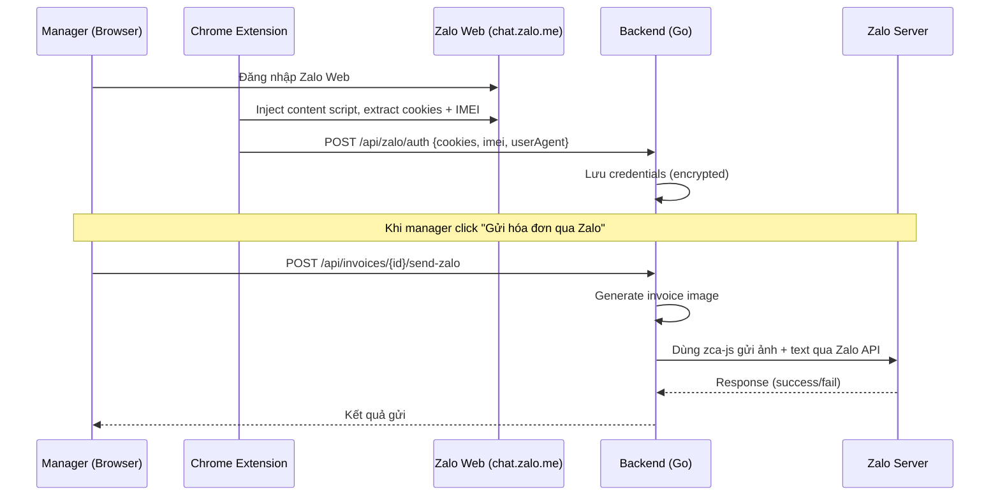
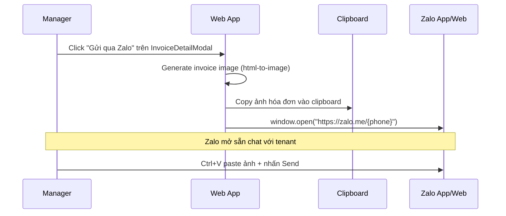
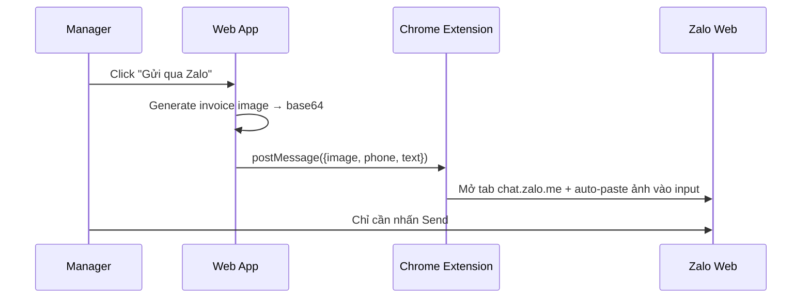

# Research: Gửi Hóa Đơn Cho Tenant Qua Zalo

## 1. Bối cảnh

Hệ thống quản lý phòng trọ đã có:
- Thông tin số điện thoại của tenant
- Tính năng tạo hóa đơn + xuất ảnh hóa đơn (frontend `html-to-image` + backend image generation)
- Flow download/preview hóa đơn đã hoàn thiện

**Mục tiêu:** Thêm action "Gửi hóa đơn qua Zalo" cho từng tenant, sử dụng tài khoản Zalo **cá nhân** của manager.

---

## 2. Phân tích các hướng tiếp cận

### Hướng A: Zalo Official Account (OA) API — Chính thống

| Tiêu chí | Chi tiết |
|:---|:---|
| **Cách hoạt động** | Đăng ký Zalo OA → Dùng OA API/ZNS gửi tin nhắn |
| **Chi phí** | OA cơ bản miễn phí, nhưng gửi tin ZNS **có phí** (~200-500đ/tin). Tin tư vấn miễn phí chỉ trong khung 48h sau tương tác |
| **Yêu cầu** | Cần giấy phép kinh doanh (hộ kinh doanh) để xác thực OA đầy đủ. OA chưa xác thực bị **giới hạn rất nhiều** (không gửi tin chủ động) |
| **Gửi theo SĐT** | Chỉ qua ZNS (có phí), cần template được Zalo phê duyệt |
| **Ưu điểm** | ✅ Ổn định, không rủi ro bị ban. ✅ Chuyên nghiệp |
| **Nhược điểm** | ❌ Tốn phí mỗi tin nhắn. ❌ Cần giấy tờ kinh doanh. ❌ Template cần phê duyệt (không linh hoạt). ❌ Không gửi được ảnh tùy ý (ZNS chỉ hỗ trợ template text) |

> [!WARNING]
> OA **chưa xác thực** (cá nhân không có giấy phép KD) gần như **không thể gửi tin chủ động** cho user. Đây là rào cản lớn nhất.

---

### Hướng B: Browser Extension + Thư viện Reverse-Engineer (zca-js/zlapi)

Đây là hướng bạn đang cân nhắc. Phân tích chi tiết:

#### Cách hoạt động
```
┌──────────────────┐     ┌──────────────────┐     ┌─────────────────┐
│  Chrome Extension │────▶│  Backend (Go)    │────▶│  Zalo Web API   │
│  (Lấy cookies/   │     │  (Dùng zca-js    │     │  (chat.zalo.me) │
│   session từ     │     │   gửi tin nhắn)  │     │                 │
│   chat.zalo.me)  │     │                  │     │                 │
└──────────────────┘     └──────────────────┘     └─────────────────┘
```

#### Các thư viện có sẵn

| Thư viện | Ngôn ngữ | GitHub | Tính năng |
|:---|:---|:---|:---|
| **zca-js** | JavaScript/Node.js | `RFS-ADRENO/zca-js` | Login QR, gửi text/media, listen events |
| **zlapi** | Python | `Its-VrxxDev/zlapi` | Gửi text/file/sticker, fetch user info |
| **openzca** | CLI (Node.js) | openzca.com | CLI tool dựa trên zca-js |

#### Rủi ro nghiêm trọng

> [!CAUTION]
> **Rủi ro bị khóa tài khoản Zalo cá nhân VĨNH VIỄN:**
> - Zalo chủ động phát hiện và chặn automation từ tài khoản cá nhân
> - Gửi tin nhắn hàng loạt (bulk) → trigger hệ thống anti-spam ngay lập tức
> - Session token/cookie có thể hết hạn bất kỳ lúc nào, Zalo có thể yêu cầu re-auth
> - Thư viện reverse-engineer **KHÔNG ổn định** — Zalo update protocol → library bị break
> - Extension lưu trữ cookies/IMEI = **vector tấn công** nếu bị lộ

#### Chi tiết kỹ thuật Extension

Nếu vẫn muốn triển khai hướng này, flow sẽ như sau:



**Đánh giá: ⚠️ KHÔNG KHUYẾN KHÍCH cho production. Chỉ phù hợp nếu chấp nhận rủi ro mất tài khoản Zalo.**

---

### Hướng C: Zalo Deep Link — Bán tự động (⭐ KHUYẾN NGHỊ)

#### Cách hoạt động

Thay vì tự động hóa hoàn toàn, hướng này tận dụng **Zalo Deep Link** để mở sẵn cuộc hội thoại với tenant trên Zalo, manager chỉ cần paste ảnh hóa đơn và nhấn gửi.

```
┌──────────────────┐     ┌──────────────────┐     ┌─────────────────┐
│  Web App (React) │────▶│  Zalo App/Web    │────▶│  Tenant's Zalo  │
│                  │     │  (Mở chat sẵn    │     │                 │
│  1. Copy ảnh HD  │     │   với tenant)    │     │                 │
│  2. Click deeplink     │                  │     │                 │
│  3. Paste + Send │     │                  │     │                 │
└──────────────────┘     └──────────────────┘     └─────────────────┘
```

#### Deep Link format
```
https://zalo.me/{phone_number}     → Universal link (web + mobile)
zalo://chat?phone={phone_number}   → Native app scheme
```

#### Flow chi tiết



#### Đánh giá

| Tiêu chí | Chi tiết |
|:---|:---|
| **Chi phí** | Miễn phí hoàn toàn |
| **Rủi ro** | ✅ Không có rủi ro — gửi thủ công như người dùng bình thường |
| **Yêu cầu** | Chỉ cần SĐT tenant + Zalo trên máy/web |
| **Tốc độ** | ~5-10 giây/tenant (copy + paste + send) |
| **Khả thi** | ✅ Triển khai ngay, không cần thêm backend |
| **Hạn chế** | Không hoàn toàn tự động, cần thao tác thủ công paste + gửi |

> [!TIP]
> Với quy mô quản lý phòng trọ (10-50 phòng), flow bán tự động này là **đủ hiệu quả**. Mỗi tháng chỉ mất 5-10 phút để gửi hóa đơn cho tất cả tenant.

---

### Hướng D: Hybrid — Deep Link + Extension tự động paste

Kết hợp C + automation nhẹ bằng extension:



> [!NOTE]
> Hướng này giảm thao tác xuống chỉ còn 1 click "Send" cho mỗi tenant. Extension chỉ tương tác với DOM của Zalo Web (paste vào input box), **không dùng API reverse-engineer**, nên rủi ro thấp hơn nhiều so với hướng B.

---

## 3. So sánh tổng hợp

| Tiêu chí | A: Zalo OA | B: Extension + zca-js | C: Deep Link ⭐ | D: Hybrid |
|:---|:---|:---|:---|:---|
| **Chi phí** | Có phí/tin | Miễn phí | Miễn phí | Miễn phí |
| **Rủi ro ban** | Không | ⚠️ Rất cao | Không | Thấp |
| **Tự động hóa** | Hoàn toàn | Hoàn toàn | Bán tự động | Gần tự động |
| **Yêu cầu giấy tờ** | Giấy phép KD | Không | Không | Không |
| **Ổn định** | Cao | Rất thấp | Cao | Trung bình |
| **Thời gian triển khai** | 1-2 tuần | 3-5 ngày | **1-2 giờ** | 2-3 ngày |
| **Phù hợp quy mô nhỏ** | Không | Không | ✅ Rất phù hợp | ✅ Phù hợp |

---

## 4. Khuyến nghị: Chiến lược phân giai đoạn

### Phase 1: Deep Link (Triển khai ngay) ⭐

Thêm nút **"Gửi qua Zalo"** vào `InvoiceDetailModal` và `InvoicesView`:

#### Thay đổi cần làm (Frontend only, không cần backend)

**File: `InvoiceDetailModal.tsx`**
- Thêm nút "Gửi qua Zalo" (icon: `MessageCircle` từ lucide-react)
- Khi click:
  1. Gọi `generateFrontendImage()` để tạo ảnh hóa đơn
  2. Convert base64 → Blob → `navigator.clipboard.write()` (copy ảnh vào clipboard)
  3. `window.open(\`https://zalo.me/${tenantPhone}\`)` — mở Zalo chat
  4. Toast notification: "Đã copy ảnh hóa đơn! Paste (Ctrl+V) vào Zalo để gửi"

**Lưu ý:**
- Cần có SĐT tenant từ API. Kiểm tra xem `Invoice` type có chứa `tenant_phone` không, nếu chưa cần bổ sung từ backend (JOIN với bảng tenants)
- `navigator.clipboard.write()` yêu cầu HTTPS hoặc localhost, và cần user gesture (click event) — phù hợp với flow hiện tại
- Fallback: nếu clipboard API không khả dụng, download ảnh rồi hướng dẫn user attach thủ công

#### Estimated effort: **1-2 giờ**

---

### Phase 2: Bulk Send (Tuần sau)

Thêm tính năng "Gửi hóa đơn Zalo cho tất cả phòng" trong `InvoicesView`:
- Loop qua danh sách invoices đã filter
- Mỗi 3 giây, tự động: copy ảnh HD tiếp theo + mở tab Zalo mới
- Manager paste + send ở từng tab

---

### Phase 3 (Tùy chọn): Nâng cấp lên Zalo OA hoặc Extension

Nếu quy mô lớn lên (>50 phòng), cân nhắc:
- Đăng ký hộ kinh doanh → Zalo OA xác thực → ZNS API
- Hoặc build Chrome Extension (hướng D) để tự động paste vào Zalo Web

---

## 5. Kết luận

> [!IMPORTANT]
> **Hướng B (Extension + zca-js reverse-engineer) KHÔNG được khuyến khích** vì:
> 1. Rủi ro bị khóa tài khoản Zalo cá nhân vĩnh viễn
> 2. Thư viện không ổn định, break khi Zalo update
> 3. Bảo mật: lưu trữ cookies/session token là vector tấn công
> 4. Vi phạm Terms of Service của Zalo
>
> **Hướng C (Deep Link)** là giải pháp tối ưu cho quy mô phòng trọ:
> - Triển khai nhanh (1-2 giờ)
> - Zero cost, zero risk
> - Đủ hiệu quả cho 10-50 phòng/tháng

Bạn muốn tôi triển khai Phase 1 (Deep Link) ngay không?
